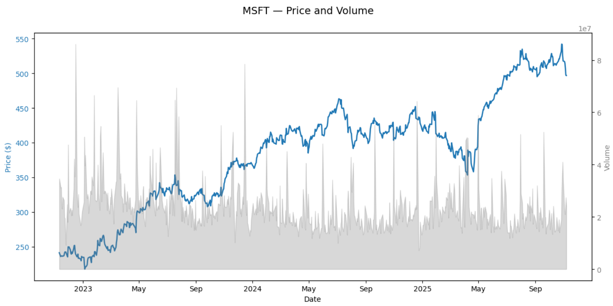
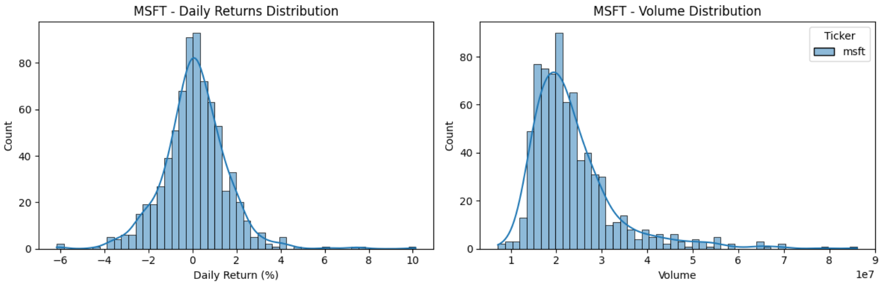
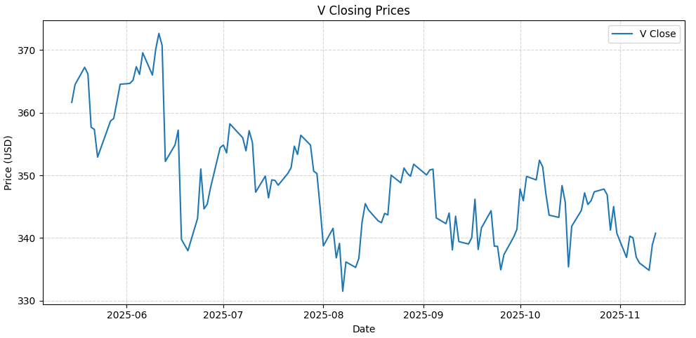
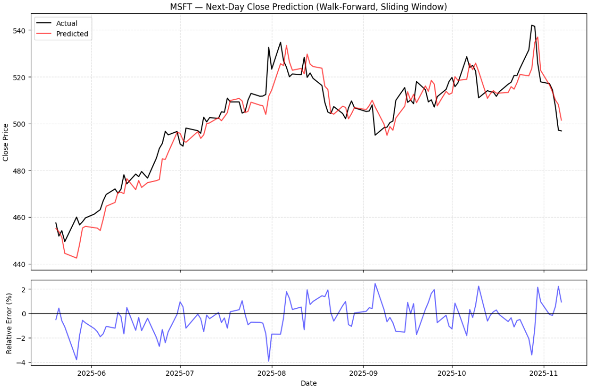
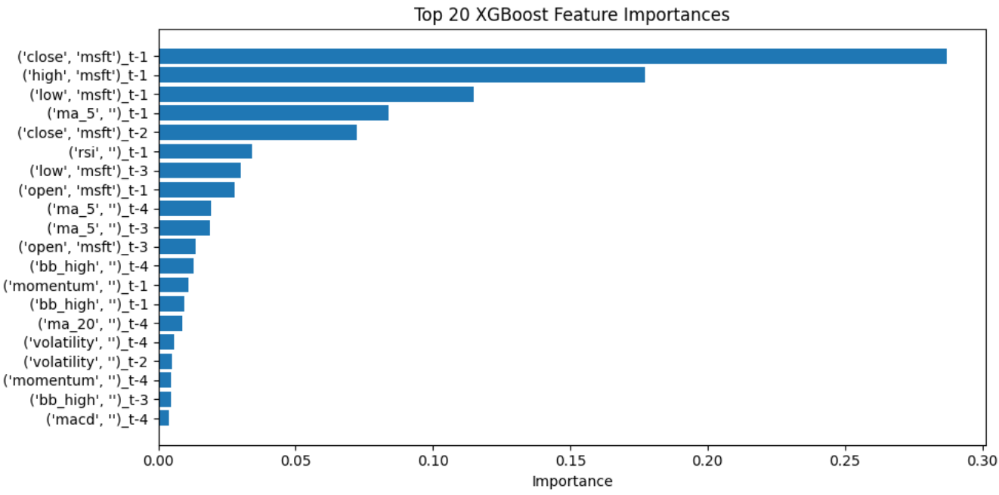
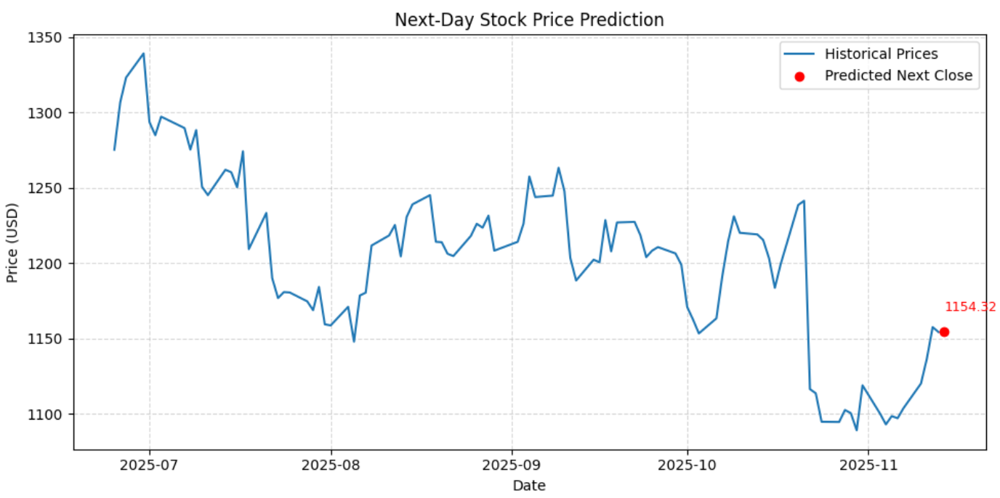

## Can Machine Learning Beat Market Noise?

Financial markets generate vast amounts of data daily, making it difficult for individual investors to distinguish meaningful signals from random fluctuations. While institutional traders rely on advanced algorithms and data-driven strategies, retail investors rarely have access to similar predictive tools.

This project explores whether machine learning can help close that gap by forecasting next-day movements of S&P 500 stocks using historical market data. The model is built with XGBoost, a gradient boosting algorithm known for capturing complex, nonlinear relationships while maintaining strong generalization performance. It has shown solid results in time series forecasting, making it well suited for this task. The full implementation is available in a [here](https://github.com/ruokokoski/predistocks/blob/main/stock_predictor.ipynb).

In traditional investing, technical indicators such as moving averages, RSI, and MACD have long been used to identify trends and momentum. Their usefulness is still debated: some believe they reflect genuine patterns in market behavior, while others see them as artifacts of randomness. This project examines whether combining these common indicators with raw price and volume data can improve the predictive accuracy of a machine learning model.

The goal is not to deliver perfect forecasts or guaranteed returns, but to demonstrate how data-driven methods can support better decision-making. By converting historical patterns into quantitative predictions, machine learning can provide a structured perspective on short-term price dynamics and potential market opportunities.

### Collecting Data

Accurate and consistent historical data is the foundation of any stock forecasting model. Before building the model, I explored several data sources and APIs, including Yahoo Finance, Finnhub, and Tiingo. Each provides access to daily stock prices, but many require registration, authentication keys, or rate-limit management, which can slow down experimentation.

For this project, the `yfinance` library in Python turned out to be the most practical choice. It offers direct and reliable access to daily **Open, High, Low, Close, and Volume (OHLCV)** data for all S&P 500 companies. The setup is straightforward, with no API keys or authentication required, which makes it easy to collect and update stock data programmatically.

The stock data for a given ticker can be easily loaded directly from Yahoo Finance. The following function demonstrates how to retrieve daily OHLCV data using Python:

```python
import yfinance as yf

def load_stock_data(ticker, start_date, end_date):
    """
    Load daily stock data for a given ticker from Yahoo Finance.
    
    Parameters:
        ticker (str): Stock symbol, e.g., 'MSFT'
        start_date (str): Start date in 'YYYY-MM-DD' format
        end_date (str): End date in 'YYYY-MM-DD' format
    
    Returns:
        pandas.DataFrame: DataFrame containing Open, High, Low, Close, Volume
    """
    stock = yf.download(ticker, start=start_date, end=end_date)
    return stock
```

### Inspecting Data

After data collection, the next step is to ensure input consistency and reliability through inspection and cleaning. This includes checking for missing values, analyzing distributions of prices and volumes, and identifying potential outliers that could bias predictions.

Microsoft (MSFT) data from the past three years was used as an example. The dataset covers 750 trading days with no missing values in the key columns — Open, High, Low, Close, and Volume — making it suitable for modeling.

Descriptive statistics provide a quick overview of the data:

| Price  | Ticker | Count | Mean        | Std        | Min       | Max        |
|--------|--------|-------|------------|-----------|-----------|-----------|
| Close  | MSFT   | 750   | 384.8      | 79.5      | 217.5     | 542.1     |
| High   | MSFT   | 750   | 388.1      | 79.9      | 220.9     | 554.5     |
| Low    | MSFT   | 750   | 381.3      | 79.3      | 214.6     | 540.8     |
| Open   | MSFT   | 750   | 384.8      | 79.8      | 218.2     | 554.3     |
| Volume | MSFT   | 750   | 23,634,120 | 9,588,958 | 7,164,500 | 86,102,000 |

Visualizing closing prices (blue) and volumes (gray) reveals long-term trends and trading activity spikes, helping identify anomalies before modeling.



Examining daily return and volume distributions further clarifies volatility behavior. Most returns fall within ±1%, while the volume histogram highlights periods of intensified trading, offering a clearer view of typical price fluctuations before model training.



### Feature Engineering

Raw stock data alone is often not enough for accurate predictions. Before feeding it into a model, the data needs to be transformed into features that capture meaningful patterns for forecasting the next day’s price.

Daily OHLCV data (Open, High, Low, Close, Volume) is processed so that past values inform the prediction of the next day’s closing price. Two feature sets are tested:

1. Using lagged OHLCV values as features, which means including the previous day or several days of prices and volumes as input.

2. Augmenting the dataset with technical indicators, which are commonly used in trading analysis, to see if they improve predictive performance.

Technical indicators summarize price trends and market behavior over time. The model includes features such as:

- **Moving averages (MA)** to capture short-term trends

- **Relative Strength Index (RSI)** signals overbought or oversold conditions

- **Momentum** tracks the speed of price changes

- **Volatility** quantifies price fluctuations

- **MACD** identifies trend direction and strength

- **Bollinger Bands** to highlight deviations from typical price ranges

These engineered features enable the model to detect structured patterns that raw OHLCV data might obscure.

### Model Training and Evaluation

Once features are prepared, the model is trained and evaluated using a rolling window approach, where past data predicts the next day’s price. This walk-forward validation mimics real trading conditions by ensuring that only historical information is used for each prediction.

Key parameters include the number of past days used as input (lag) and the length of the training window. These are optimized separately for each stock, as behavior varies: volatile stocks may benefit from shorter lags to capture rapid shifts, while more stable ones may require longer windows to detect trends.

The model is tested both with raw OHLCV data and with added technical indicators. Performance is evaluated using:

- **Mean Absolute Error (MAE)** – the average absolute difference between predicted and actual prices.

- **Mean Absolute Percentage Error (MAPE)** – the average absolute percentage difference between predictions and actual values.

- **Root Mean Squared Error (RMSE)** – the square root of the average squared prediction errors.

- **R²**, which indicates how much of the variance in actual prices is explained by the model.

- **Directional Accuracy (DA)**, which shows how often the model correctly predicts the next day’s price movement.

While several years of historical data are collected, the actual next-day prediction relies only on the most recent training window. Longer histories are mainly used to identify the optimal lag–window combination.

For example, in Microsoft (MSFT), adding technical indicators improves accuracy across all metrics:

| Feature Set  | Lag | Training Window | MAE  | MAPE  | R²    | Directional Accuracy |
|-------------|-----|----------------|------|-------|-------|--------------------|
| Without TA  | 5   | 120            | 5.42 | 1.08% | 0.901 | 48.8%              |
| With TA     | 4   | 100            | 4.88 | 0.97% | 0.911 | 52.9%              |


To illustrate differences between stocks, the table below summarizes the best-performing configurations (while optimizing for MAPE).

| Ticker | Lag | Training Window | MAPE | DA |
|--------|-----|----------------|-----------|---------|
| MSFT   | 4   | 100            | 0.986%    | 52.94%  |
| KO     | 3   | 100            | 0.751%    | 55.37%  |
| JNJ    | 2   | 80             | 0.961%    | 53.52%  |
| V      | 2   | 90             | 1.028%    | 45.11%  |
| NFLX   | 3   | 100            | 1.403%    | 57.02%  |

Visa’s lower performance likely reflects its recent sideways price movement. When a stock fluctuates within a narrow range without a clear trend, the model struggles to extract consistent predictive patterns. The figure below shows Visa’s price behavior over the past six months.



### Hyperparameter Optimization

The model’s performance was further improved through hyperparameter tuning using **Optuna**, which systematically searches for the best parameter combinations through walk-forward validation.

Different optimization objectives were explored depending on the focus of prediction — minimizing errors or improving directional accuracy (DA):

- **MAPE**: Measures prediction errors as a percentage, making it easy to compare across stocks with different price levels.

- **Combined MAPE + DA**: Balances both prediction accuracy and the correct direction of movement.

- **DA alone**: Focuses on predicting whether the stock will go up or down, without considering the magnitude of the error.

These objectives often conflict. A model might correctly predict that a stock will rise but overestimate the magnitude, producing a high MAPE. Conversely, it might predict the price level accurately but miss the direction if the true change is small.

Since this is a regression model, it is fundamentally designed to predict numeric prices. Metrics like MAPE, MAE, or RMSE are therefore the natural focus. Optimizing for directional accuracy is indirect because the model is not explicitly trained as a classifier. If the main goal is predicting the **direction** rather than the exact price, a classification model (e.g., logistic regression, XGBoost classifier, or other tree-based classifiers) may be more appropriate.

The results for **Microsoft (MSFT)** under different optimization objectives are summarized below:

| Optimization Objective | Best MAPE | Best DA  |
|------------------------|-----------|----------|
| MAPE                   | 0.98607   | 52.94%   |
| MAPE + DA (combined)   | 0.94722   | 52.94%   |
| DA                     | 0.98031   | 58.82%   |

Optimizing the combined **MAPE + DA** objective yields the lowest error, while focusing solely on **DA** improves the model’s ability to predict the direction of price changes. These trade-offs vary between stocks and depend on the specific optimization goal.

The following plot illustrates MSFT’s walk-forward predictions:

- **Top panel**: actual vs. predicted next-day closing prices.

- **Bottom panel**: relative prediction errors in percentage terms.



### Feature Importance

To understand what drives the model’s predictions, feature importance analysis was performed using the trained XGBoost model. Each input, whether a lagged price, moving average, or technical indicator, is assigned a score that reflects its influence on the prediction of the next day's stock price. Looking at the most recent training window, short-term lagged prices, moving averages, and RSI consistently rank as the most influential features, while other indicators play a smaller role. A visualization of the top 20 features makes it easy to see which pieces of historical data the model relies on most.



Low-importance features can be pruned to simplify the model and reduce noise. Retraining the model after removing these features can enhance interpretability and sometimes improve accuracy. However, selecting the pruning threshold is another optimization problem: if it is too strict, useful information may be lost or if too loose, irrelevant features may remain.

### Final Model Training

After choosing the optimal hyperparameters, the model is retrained on the most recent data window. The features are rebuilt using the selected lag and technical indicators, and the final XGBoost regressor is fitted on this latest window to produce the next-day prediction.

The figure below shows the model’s next-day closing price prediction for Netflix based on the most recent historical data.



### Conclusions

Short-term stock price prediction remains difficult due to the noisy and stochastic nature of financial time series. The XGBoost model achieved a **MAPE of around 1%** and **directional accuracy ranging from approximately 52% to 57%**. When specifically optimized for directional accuracy, the model can achieve up to **60%** accuracy for certain stocks, which is similar to the benchmark reported in *An Introduction to Statistical Learning: With Applications in Python*.

Adding **technical indicators** consistently improved performance by slightly reducing errors, increasing explained variance, and enhancing directional accuracy. This suggests that technical analysis features can provide additional predictive value beyond raw price and volume data.

Although the results show that machine learning can extract useful patterns from market data, the model still requires further fine-tuning before practical use. Hyperparameter optimization is computationally demanding, and each stock tends to require a unique configuration. Overall, model offers a solid foundation for next-day price forecasting but would need additional refinement and validation for real-world application.
